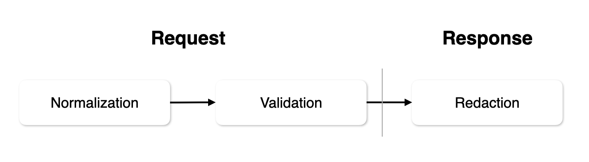

<h1 align='center'>
  Thing :dizzy:
</h1>

<p align="center"><strong>A rule-based entity management library written in Kotlin</strong></p>

<p align='center'>
  <a href="https://cobalt.run">
    
  </a>
  <a href="https://central.sonatype.com/artifact/so.kciter/thing">
    
  </a>
  <a href="">
    
  </a>
</p>

## :rocket: Getting started
```kotlin
implementation("so.kciter:thing:{version}")
```

## :eyes: At a glance
```kotlin
data class Person(
  val email: String,
  val creditCard: String
): Thing<Person> {
  override val rule: Rule<Person>
    get() = Rule {
      Normalization {
        Person::email { trim() }
        Person::creditCard { trim() }
      }

      Validation {
        Person::email { email() }
      }

      Redaction {
        Person::creditCard { creditCard() }
      }
    }
}

val person = Person(
  email = " kciter@naver   ",
  creditCard = "1234-1234-1234-1234"
)

println(person)
// Person(email= kciter@naver   , creditCard=1234-1234-1234-1234)
println(person.normalize())
// Person(email=kciter@naver, creditCard=1234-1234-1234-1234)
println(person.validate())
// ValidationResult.Invalid(dataPath=.email, message=must be a valid email address)
println(person.redact())
// Person(email=kciter@naver, creditCard=[REDACTED])
```

## :sparkles: Usecase
### Validation
Bad data can always be entered. You need to filter out bad data. In this case, you can use `Validation`.

For example, you can validate the email field.
```kotlin
data class Person(
  val email: String
): Thing<Person> {
  override val rule: Rule<Person>
    get() = Rule {
      Validation {
        Person::email { email() }
      }
    }
}
```
Then run the `validate` function, which returns the result of the validation.
```kotlin
val person = Person(
  email = "kciter@naver"
)
println(person.validate())
// ValidationResult.Invalid(dataPath=.email, message=must be a valid email address)
```

You can also use different logic based on the validation results.

```kotlin
val result = person.validate()
when (result) {
  is ValidationResult.Valid -> {
    /* ... */
  }
  is ValidationResult.Invalid -> {
    /* ... */
  }
}
```

### Normalization
Data often comes to us in the wrong form. Sometimes it's unavoidable if it's very different, but sometimes a little tweaking will put it in the right shape. In these cases, you can use `Normalization`.

For example, you can `trim` login form data.
```kotlin
data class Login(
  val email: String,
  val password: String
): Thing<Person> {
  override val rule: Rule<Login>
    get() = Rule {
      Normalization {
        Login::email { trim() }
        Login::password { trim() }
      }
    }
}
```
Then run the `normalize` function, which changes the data to the correct form.
```kotlin
val loginData = Login(
  email = "  kciter@naver.com    ",
  password = "1q2w3e4r!"
)
println(loginData.normalize()) // Login(email=kciter@naver.com, password=1q2w3e4r!)
```

### Redaction
Sometimes there's information you don't want to show. In such cases we can use the `Reaction`.

For example, card information can be sensitive, so write a condition in the `rule` to redact if the `creditCard` field contains card information.
```kotlin
data class Foo(
  val creditCard: String
): Thing<Person> {
  override val rule: Rule<Foo>
    get() = Rule {
      Redaction {
        Foo::creditCard { creditCard() }
      }
    }
}
```

Then run the `redact` function, which changes the data to `[REDACTED]`.
```kotlin
val foo = Foo(
  creditCard = "1234-1234-1234-1234"
)

foo.redact()
println(foo) // Foo(creditCard=[REDACTED])
```

### With Spring Boot
If you want to use Spring Boot and Thing together, you can use `thing-spring`.

```kotlin
implementation("so.kciter:thing:{version}")
implementation("so.kciter:thing-spring:{version}")
```

You can use the `@ThingHandler` annotation instead of the `@Validated` annotation in [Bean Validation(JSR-380)](https://beanvalidation.org/2.0-jsr380/spec/).

If the Controller contains the `@ThingHandler` annotation, `ThingPostProcessor` check to see if a `Thing` object exists when the function is executed. If a `Thing` object exists, it normalizes it before running the function and then performs validation. And when we return the result, if it's a `Thing` object, we return it after redacting.



```kotlin
@ThingHandler
@RestController
@RequestMapping("/api")
class ApiController {
  @PostMapping
  fun createPerson(@RequestBody person: Person): AnyResponse {
    /* ... */
  }
}
```

Instead of adding an annotation to a class, you can also add it to a method. In this case, it will only work on specific methods, not the class as a whole.

```kotlin
@ThingHandler
@PostMapping
fun createPerson(@RequestBody person: Person): AnyResponse {
  /* ... */
}
```

#### 🆚 Bean Validation
|                              | Thing          | Bean Validation     |
|------------------------------|----------------|---------------------|
| How to use                   | Kotlin DSL     | Annotation          |
| Custom Validation            | Easy to extend | Difficult to extend |
| Nested                       | Easy           | Confuse             |
| Support Iterable, Array, Map | ✅              | ❌                   |
| Validation                   | ✅              | ✅                   |
| Normalization                | ✅              | ❌                   |
| Redaction                    | ✅              | ❌                   |
| Can use with Spring Boot     | ✅              | ✅                   |

Bean Validation is a great library. However, it is not suitable for all cases. For example, if you want to normalize or redact data, you can't do it with Bean Validation. In this case, you can use Thing.

### Nested
Thing supports nested data. For example, if you have a `Group` object that contains a `person` field, you can use it as follows:

```kotlin
data class Person(
  val name: String,
  val email: String
)

data class Group(
  val person: Person
): Thing<Group> {
  override val rule: Rule<Group>
    get() = Rule {
      Validation {
        Group::person {
          Person::name { notEmpty() }
          Person::email { email() }
        }
      }
    }
}
```

### Iterable, Array, Map
Thing supports `Iterable`, `Array`, and `Map` types. For example, if you have a `Group` object that contains a `people` field, you can use it as follows:

```kotlin
data class Person(
  val name: String,
  val email: String
)

data class Group(
  val people: List<Person>
): Thing<Group> {
  override val rule: Rule<Group>
    get() = Rule {
      Validation {
        Group::people {
          onEach {
            Person::name { notEmpty() }
            Person::email { email() }
          }
        }
      }
    }
}
```

### Add Custom Rule
You may want to add custom rules in addition to the ones provided by default. If so, you can do so as follows:

```kotlin
data class Foo(
  val data: String
): Thing<Person> {
  override val rule: Rule<Foo>
    get() = Rule {
      Validation {
        Foo::data {
          addValidator("must be `bar`") {
            it == "bar"
          }
        }
      }
    }
}
```
`Normalization` and `Redaction` also addition custom rules.

```kotlin
data class Foo(
  val data: String
): Thing<Person> {
  override val rule: Rule<Foo>
    get() = Rule {
      Normalization {
        Foo::data {
          addNormalizer {
            it.replace("bar", "foo")
          }
        }
      }

      Redaction {
        Foo::data {
          addRedactor("[REDACTED]") {
            it.contains("bar")
          }
        }
      }
    }
}
```

If you need a common rule that you use in multiple places, you can write it like this:

```kotlin
fun ValidationRuleBuilder<String>.isBar() {
  addValidator("must be `bar`") {
    it == "bar"
  }
}

fun NormalizationRuleBuilder<String>.replaceBarToFoo() {
  addNormalizer {
    it.replace("bar", "foo")
  }
}

fun RedactionRuleBuilder<String>.redactBar() {
  addRedactor("[REDACTED]") {
    it.contains("bar")
  }
}

data class Foo(
  val data: String
): Thing<Person> {
  override val rule: Rule<Foo>
    get() = Rule {
      Normalization {
        Foo::data { replaceBarToFoo() }
      }

      Validation {
        Foo::data { isBar() }
      }

      Redaction {
        Foo::data { redactBar() }
      }
    }
}
```

## :love_letter: Reference
* [konform](https://github.com/konform-kt/konform)
  * If you need multi-platform validator, recommend this.
* [redact-pii](https://github.com/solvvy/redact-pii)

## :page_facing_up: License

Thing is made available under the [MIT License](./LICENSE).
